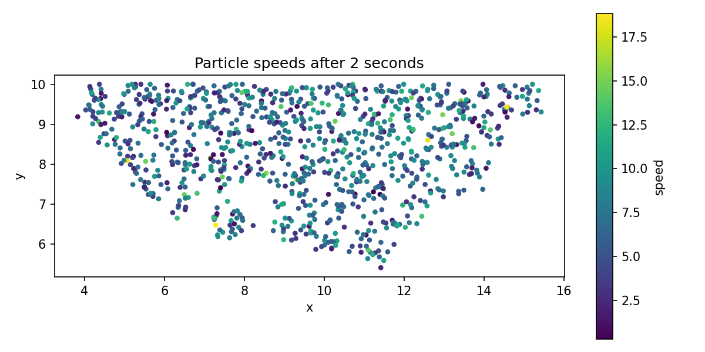

# SPH

This repository contains a simple Smoothed Particle Hydrodynamics (SPH) simulation.

## Build instructions

### Visual Studio

1. Open `WindowsProject_optimization_SPH.sln` with Visual Studio 2022 (or
   newer).
2. Select the `x64` configuration and build either `Debug` or `Release`.
3. Binaries will be placed in `x64/Debug` or `x64/Release`.

### CMake

The library and Python bindings can also be built on platforms that have
CMake available.

1. Execute the setup script to install dependencies and perform an initial
   build:

   ```console
   ./setup.sh
   ```

2. To run CMake manually, use the following commands:

   ```console
   mkdir build
   cd build
   cmake -DUSE_CUDA=OFF ..   # set to ON when the CUDA toolkit is available
   cmake --build . --target _sph
   ```

   The resulting `_sph` Python extension is created inside the `build`
   directory.

## Using the Python module

The bindings expose a `PyWorld` class:

```python
from _sph import PyWorld
w = PyWorld()
w.step(1/60.0)
positions = w.get_positions()
```

## Running the example GUI

After building the Visual Studio solution an executable named
`WindowsProject_optimization_SPH.exe` will be produced inside the build
output directory.  Launching this executable starts the example GUI
showing the SPH simulation.

While running the GUI you can control the simulation using the keyboard:

- Press **Space** to pause or resume.
- When paused, press **S** to advance a single time step.
- Press **R** to restart the simulation.

## Running the Python demo

After building the `_sph` Python extension a small demo can be launched
using Pygame:

```console
python examples/run_gui.py
```

## Visualizing particle velocities

After building the Python extension you can generate a scatter plot of the
particle positions with colors representing their speed:

```console
PYTHONPATH=build/bindings python examples/plot_snapshot.py
```

Running the script produces an image named `snapshot.png` in the
`examples` directory.

Below is a sample output generated by the script:


